# Baldur's Gate: Enhanced Edition on Android

This gallery shows Baldur's Gate: Enhanced Edition running in GemRB on an
Android API 36 x86_64 emulator at 1280x720. The captures cover startup,
gameplay, character management, spell books, maps, options, saved games, and
character generation.

The game content came from a local BGEE installation. This directory contains
screenshots only; no game data is included.

For a full-window browser gallery, open [index.html](index.html).

| | |
| --- | --- |
| 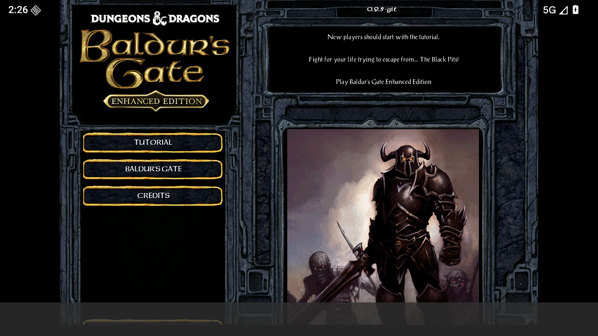 Campaign selection | 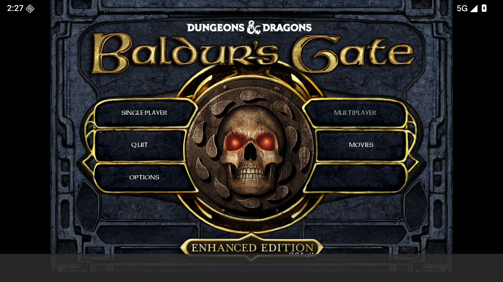 Main menu |
| 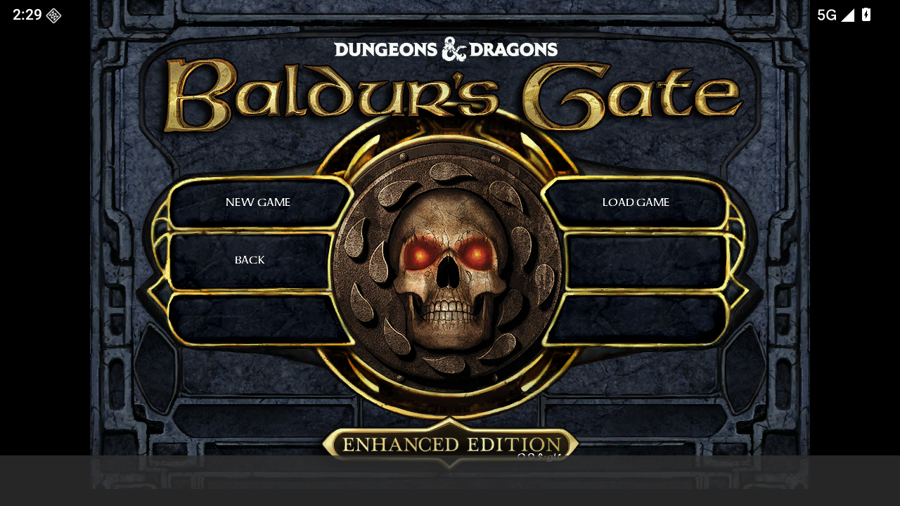 Single-player menu | 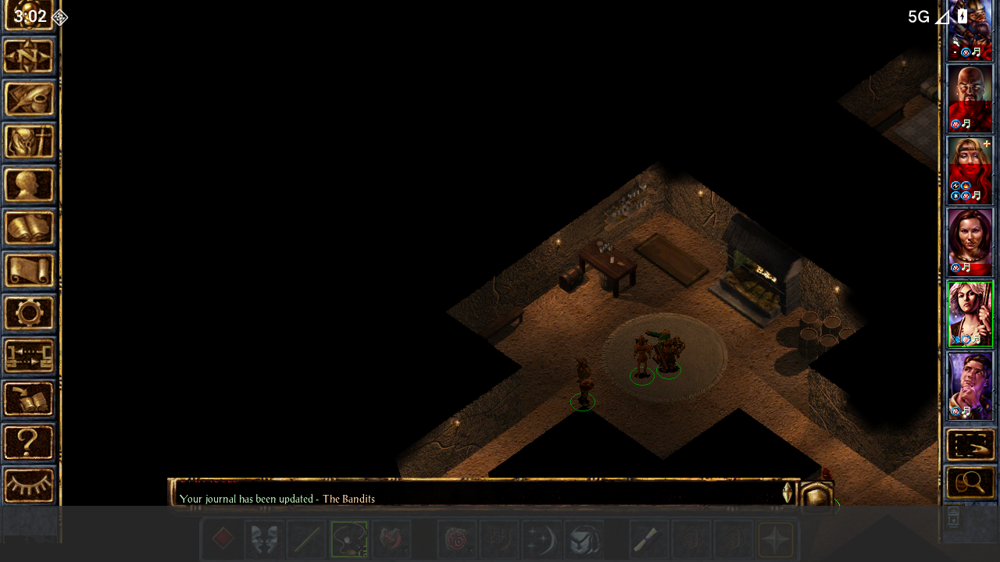 Chapter 5 gameplay |
| 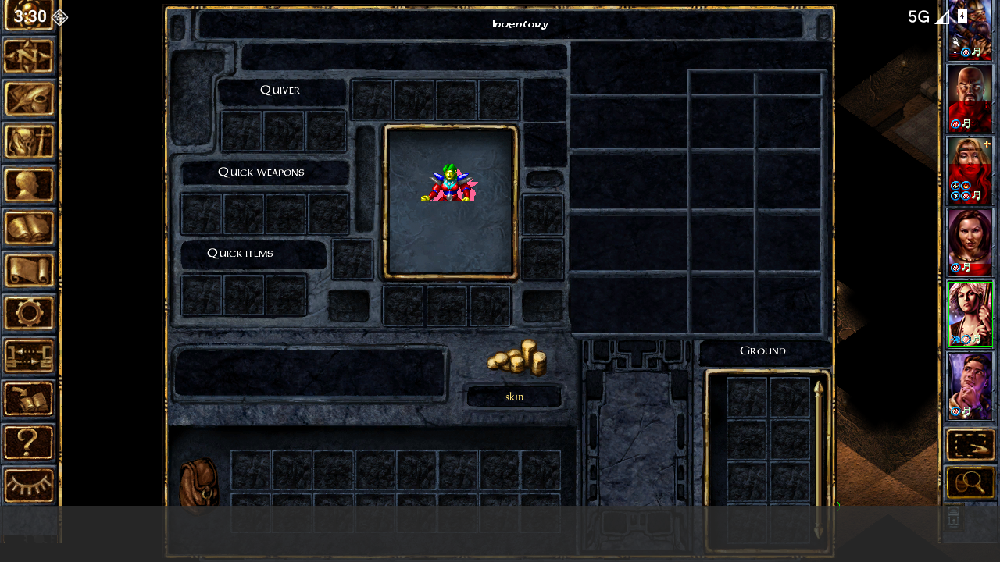 Inventory | 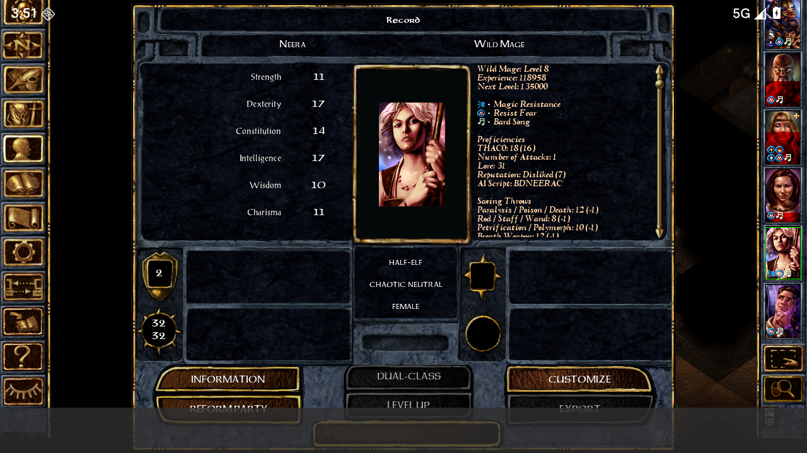 Character record |
| 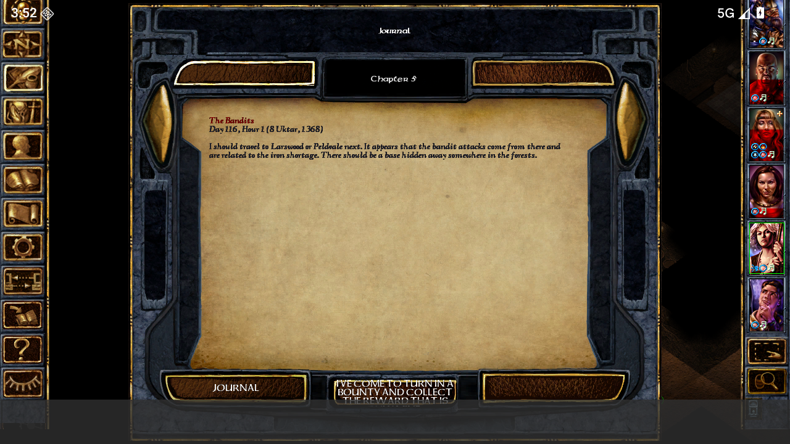 Journal | 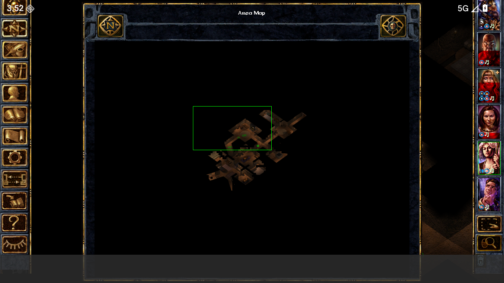 Area map |
| 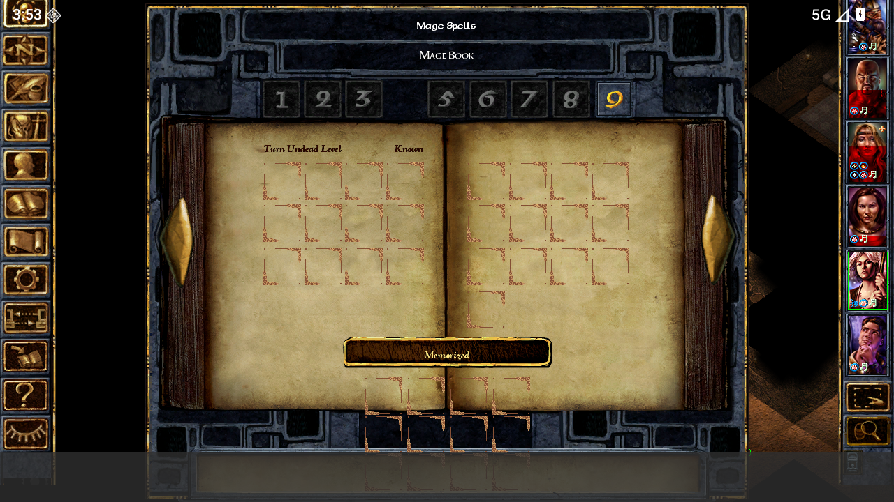 Wizard spells | 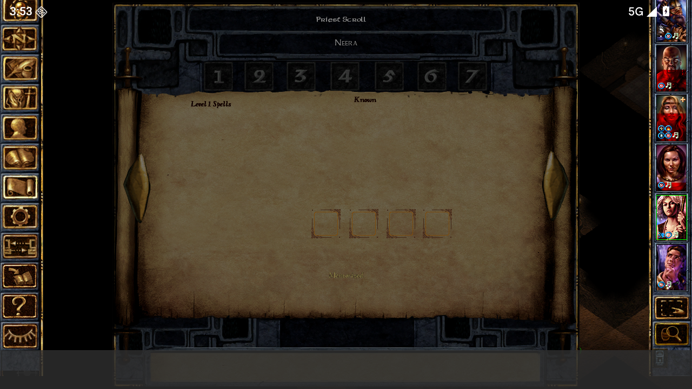 Priest spells |
| 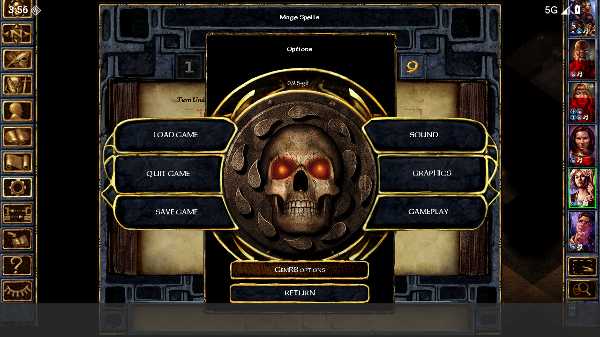 In-game options | 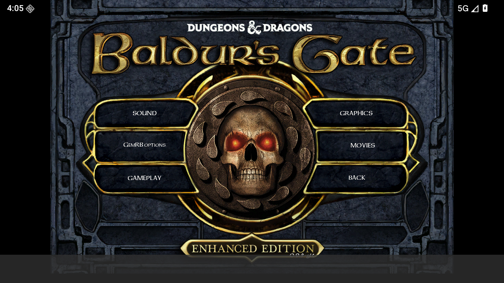 Startup options |
| 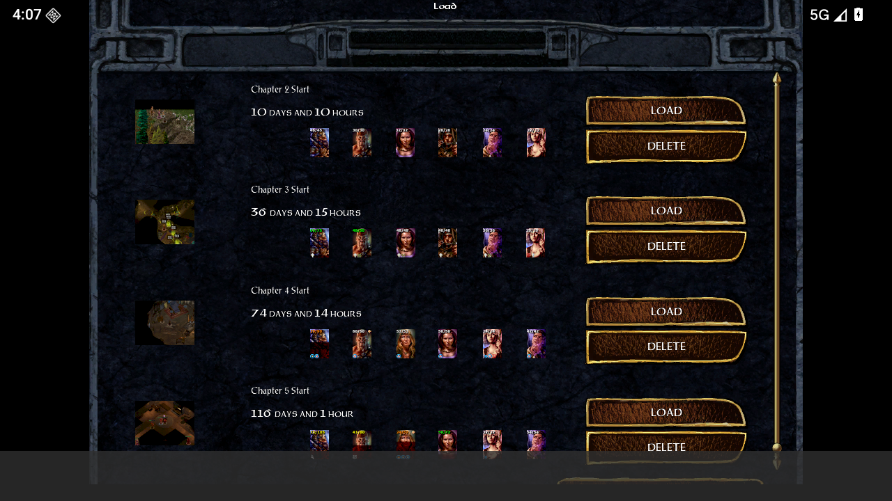 Load-game browser | 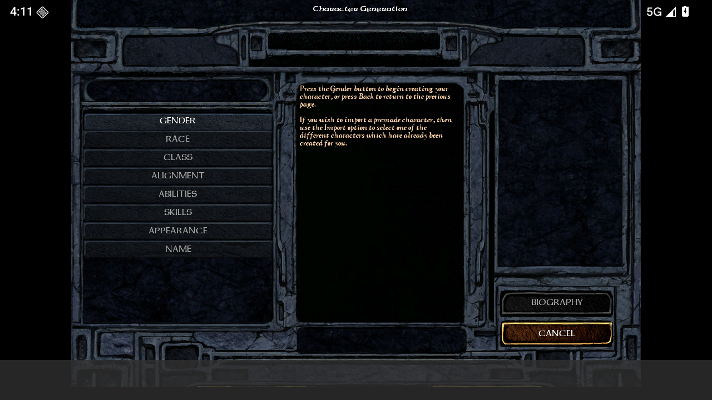 Character generation |
| 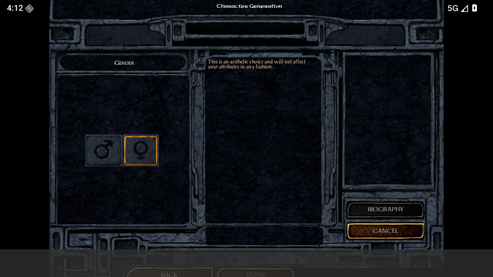 Character gender selection | |
